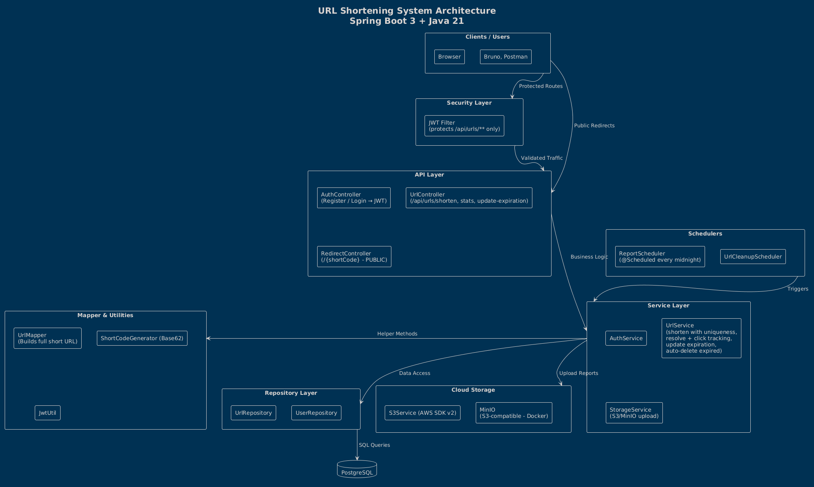
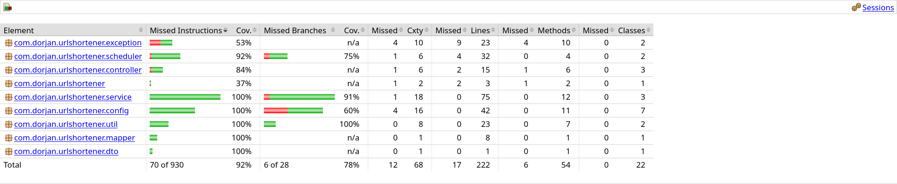

# URL Shortener Service

A URL shortening system built with Spring Boot, PostgreSQL, Docker and JWT authentication. Users can shorten URLs, track click counts, and manage expiration times through a RESTful API.

## Architecture



## Features

- Shorten long URLs into unique short codes
- Redirect short URLs to their original destinations
- Configurable expiration time (default: 5 minutes)
- Automatic cleanup of expired URLs
- Click tracking for each shortened URL
- Duplicate URL detection with expiration reset
- JWT authentication for secured endpoints
- Daily CSV report generation uploaded to S3-compatible storage (MinIO)
- Swagger/OpenAPI documentation
- 93%+ test coverage with unit and integration tests

## Tech Stack

- **Java 21**
- **Spring Boot 3.5**
- **PostgreSQL 16** — relational database
- **Spring Security + JWT** — authentication
- **MinIO** — S3-compatible cloud storage for reports
- **Docker Compose** — container orchestration
- **Apache Commons CSV** — CSV report generation
- **SpringDoc OpenAPI** — API documentation
- **JUnit 5 + Mockito** — unit testing
- **Testcontainers** — integration testing with real PostgreSQL and MinIO

## Prerequisites

- Java 21
- Maven
- Docker and Docker Compose

## Getting Started

### 1. Clone the repository

```bash
git clone https://github.com/dorjanhysa/url-shortener-project.git
cd url-shortener-project
```

### 2. Configure environment variables

Create a `.env` file in the project root (see `.env.example` for reference):

```
DB_NAME=urlshortener
DB_USERNAME=your_db_username
DB_PASSWORD=your_db_password
JWT_SECRET=your_jwt_secret_key_min_32_characters
MINIO_ACCESS_KEY=your_minio_access_key
MINIO_SECRET_KEY=your_minio_secret_key
MINIO_BUCKET_NAME=url-reports
MINIO_ENDPOINT=http://localhost:9000
```

### 3. Start the infrastructure

```bash
docker compose up -d
```

This starts PostgreSQL and MinIO containers.

### 4. Run the application

```bash
mvn spring-boot:run
```

The application starts on `http://localhost:8080`.

### 5. Access the API documentation

Open `http://localhost:8080/swagger-ui.html` to explore and test the API.

## API Endpoints

### Authentication (public)

| Method | Endpoint             | Description              |
|--------|----------------------|--------------------------|
| POST   | `/api/auth/register` | Register a new user      |
| POST   | `/api/auth/login`    | Login and get JWT token  |

### URL Operations (require JWT token)

| Method | Endpoint                              | Description             |
|--------|---------------------------------------|-------------------------|
| POST   | `/api/urls/shorten`                   | Shorten a URL           |
| GET    | `/api/urls/{shortCode}/stats`         | Get URL statistics      |
| PUT    | `/api/urls/{shortCode}/expiration?minutes=N` | Update expiration time |

### Redirect (public)

| Method | Endpoint        | Description               |
|--------|-----------------|---------------------------|
| GET    | `/{shortCode}`  | Redirect to original URL  |

## Usage Example

**Register:**
```bash
curl -X POST http://localhost:8080/api/auth/register \
  -H "Content-Type: application/json" \
  -d '{"username": "user1", "password": "pass123"}'
```

**Login:**
```bash
curl -X POST http://localhost:8080/api/auth/login \
  -H "Content-Type: application/json" \
  -d '{"username": "user1", "password": "pass123"}'
```

**Shorten a URL (with token):**
```bash
curl -X POST http://localhost:8080/api/urls/shorten \
  -H "Content-Type: application/json" \
  -H "Authorization: Bearer <your-token>" \
  -d '{"longUrl": "https://www.google.com", "expirationMinutes": 10}'
```

**Get stats:**
```bash
curl -X GET http://localhost:8080/api/urls/<shortCode>/stats \
  -H "Authorization: Bearer <your-token>"
```

**Update expiration:**
```bash
curl -X PUT "http://localhost:8080/api/urls/<shortCode>/expiration?minutes=30" \
  -H "Authorization: Bearer <your-token>"
```

**Redirect (open in browser):**
```
http://localhost:8080/<shortCode>
```

## Scheduled Jobs

| Job              | Schedule          | Description                                                    |
|------------------|-------------------|----------------------------------------------------------------|
| URL Cleanup      | Every 60 minutes  | Deletes expired URLs from the database                        |
| CSV Report       | Daily at midnight | Generates a report (urlId, shortUrl, longUrl, totalClicks) and uploads to MinIO |

## MinIO Console

Access the MinIO web console at `http://localhost:9001` to view uploaded CSV reports. Login with the credentials from your `.env` file.

## Testing

The project includes both unit tests and integration tests:

```bash
# Run all tests
mvn test

# Run tests with coverage report
mvn verify
```

Coverage report is generated at `target/site/jacoco/index.html`.



| Test type         | Tools                  | Purpose                                    |
|-------------------|------------------------|--------------------------------------------|
| Unit tests        | JUnit 5 + Mockito      | Test individual components in isolation    |
| Integration tests | Testcontainers         | Full flow with real PostgreSQL and MinIO   |

## Project Structure

```
src/main/java/com/dorjan/urlshortener/
├── config/          SecurityConfig, S3Config, OpenApiConfig, JwtAuthFilter, Properties
├── controller/      AuthController, UrlController, RedirectController
├── dto/             ShortenUrlRequest, LoginRequest, RegisterRequest, UrlResponse, AuthResponse, ErrorResponse
├── exception/       BusinessException, GlobalExceptionHandler
├── mapper/          UrlMapper
├── model/           Url, User (JPA entities)
├── repository/      UrlRepository, UserRepository
├── scheduler/       UrlCleanupScheduler, ReportScheduler
├── service/         AuthService, UrlService, StorageService
└── util/            JwtUtil, ShortCodeGenerator 

src/test/java/com/dorjan/urlshortener/
├── controller/      AuthControllerIntegrationTest, UrlControllerIntegrationTest
├── mapper/          UrlMapperTest
├── scheduler/       ReportSchedulerTest, UrlCleanupSchedulerTest
├── service/         AuthServiceTest, UrlServiceTest, StorageServiceTest
├── util/            JwtUtilTest
├── BaseIntegrationTest
└── UrlshortenerApplicationTests
```